# IAM Metrics and Audit Evidence System

**Built by Justin Gallimore | IAM Engineer**  
[LinkedIn](https://www.linkedin.com/in/justingallimore) | [GitHub](https://github.com/JustinGallimore)

---

## What This Project Is

This is a two-version Identity and Access Management portfolio project that demonstrates real enterprise IAM engineering skills. It covers identity inventory, KPI reporting, audit evidence collection, cloud identity integration using Microsoft Entra ID and MS Graph API, and executive-level dashboard reporting using Power BI.

Version 1 was built entirely on-premises using Active Directory and PowerShell. Version 2 took everything from Version 1 and scaled it to the cloud using Microsoft Entra ID, MS Graph API, and Power BI Desktop. Together they tell a hybrid identity story that shows both on-prem and cloud IAM engineering in one portfolio.

This is not a tutorial project. Every script, every report, and every dashboard was built hands-on in a real homelab environment running Windows Server 2022 in VMware Workstation connected to a live Microsoft Entra ID tenant.

---

## Tools and Technologies Used

**Version 1**
- Windows Server 2022 (VMware Workstation homelab)
- Active Directory Domain Services
- PowerShell 5.1
- HTML and CSS (dark-themed dashboard)

**Version 2**
- Microsoft Entra ID (Azure AD)
- Microsoft Graph API
- PowerShell with MSAL authentication
- Power BI Desktop
- Azure Cloud Shell
- Microsoft 365 Developer Tenant

---

## Folder Structure

```
IAM-Metrics-Audit-Portfolio/
    README.md
    V1-Active-Directory/
        01-Identity-Inventory/
        02-KPI-Framework/
        03-Audit-Evidence/
        04-Dashboard/
        05-Executive-Summary/
        README.md
    V2-Entra-ID-MSGraph/
        01-MSGraph-Export/
            scripts/
            screenshots/
            exports/
        02-PowerBI-Dashboard/
            Screenshots/
            IAM_Dashboard_V2.pbix
```

---

## Version 1: Active Directory and PowerShell

### What Version 1 Demonstrates

Version 1 shows how to build a functioning IAM audit and reporting system using only tools available in most enterprise on-premises environments. No cloud required. Just Active Directory, PowerShell, and a browser.

The goal was to answer three questions that every IAM team gets asked during audits:

- Who has access right now and what does that look like across the organization?
- Are we meeting our key performance indicators around account hygiene?
- Can we produce timestamped audit evidence on demand?

---

### Phase 1: Identity Inventory

The first thing any IAM engineer does when they walk into an environment is take inventory. You cannot govern what you cannot see.

**Screenshot 01 - PowerShell Folders Created**

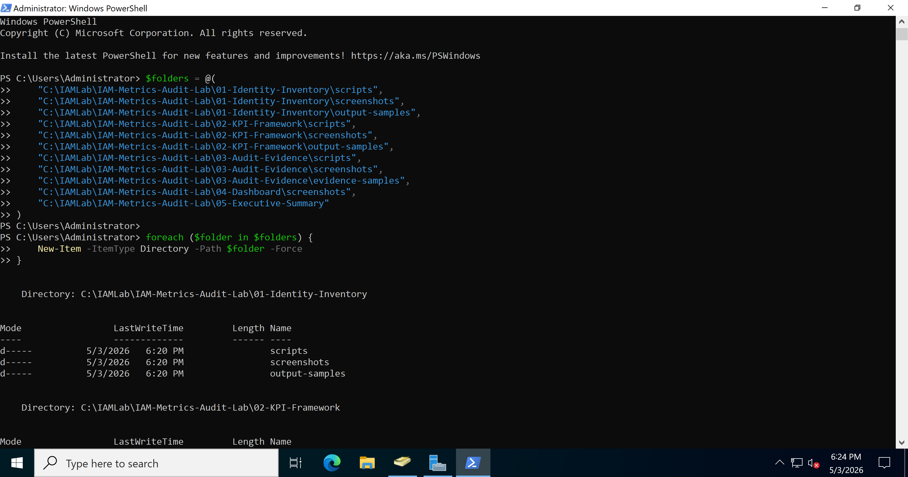

The project folder structure was built using PowerShell. Five phase folders were created at C:\IAMLab\IAM-Metrics-Audit-Lab to keep scripts, reports, and evidence organized the same way a real enterprise IAM team would organize a project drive.

---

**Screenshot 02 - File Explorer Folder Tree**

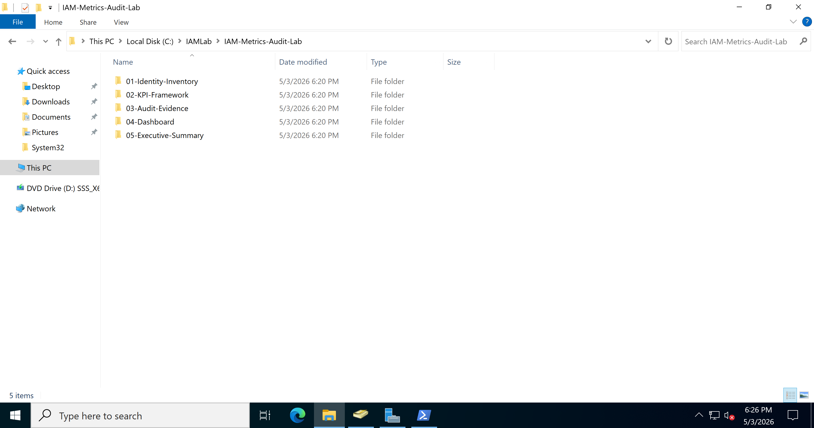

This confirms the folder structure from inside File Explorer. In a real audit engagement you would want to show an auditor exactly where your evidence lives and that it is organized in a repeatable way.

---

**Screenshot 03 - Script File Created**

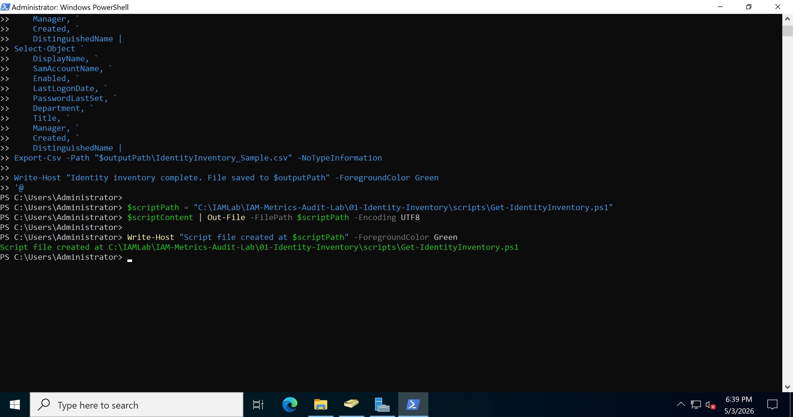

The identity inventory script was written to pull every user account from Active Directory and export it as a timestamped CSV file. The script captures account name, department, enabled or disabled status, last logon date, and password last set date. These are the exact fields that show up in SOC 2 and ISO 27001 access reviews.

---

**Screenshot 04 - Identity Inventory Complete**

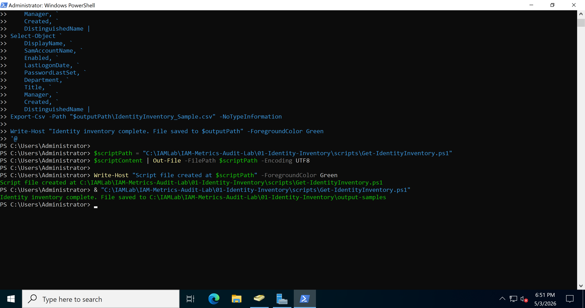

The script ran successfully and exported the full user inventory. Every account in the domain is now visible in a structured report that can be handed to a compliance team or an auditor.

---

**Screenshot 05 - Identity Inventory CSV in Notepad**

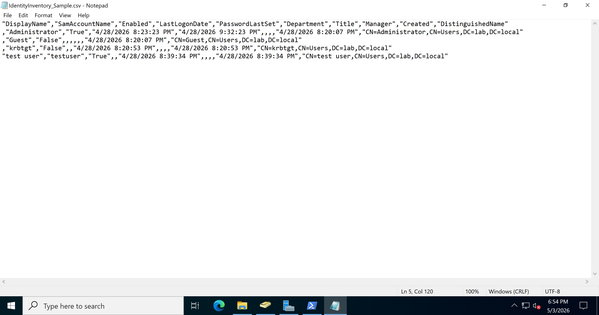

The raw CSV output opened in Notepad confirms the data structure. Each row is one user account. Each column maps to a field that matters for identity governance like department, enabled status, and last logon.

---

**Screenshot 06 - Dummy Users Created**

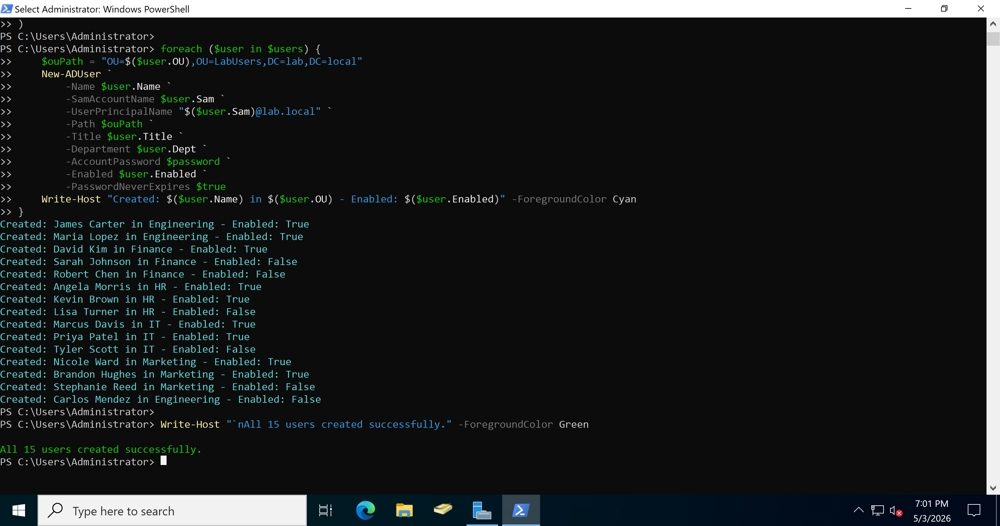

15 realistic test users were created in Active Directory across Engineering, Finance, HR, IT, and Marketing departments. The accounts include a mix of enabled and disabled status to simulate a real workforce.

---

**Screenshot 07 - Identity Inventory Updated**

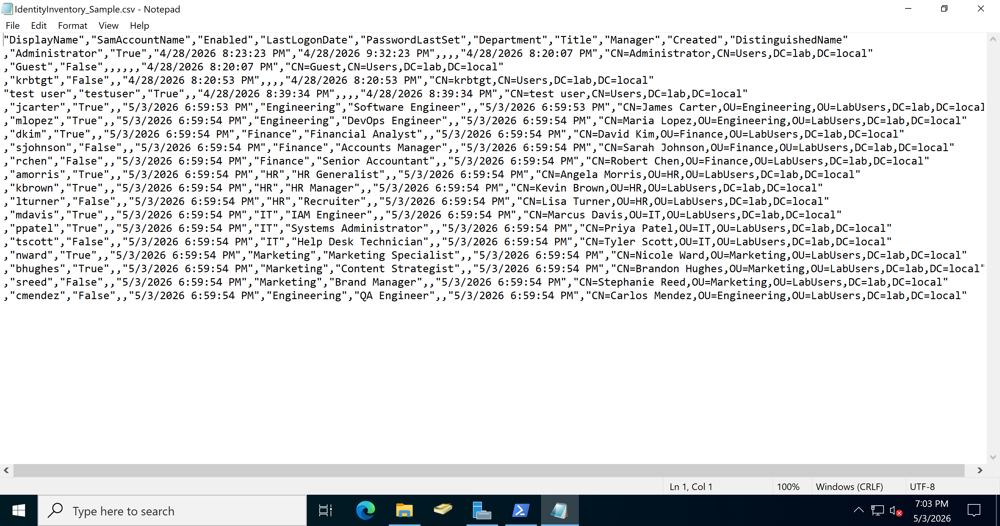

After the dummy users were created the inventory script was run again to capture the updated account list. This demonstrates that the script is repeatable and always reflects the current state of the directory.

---

### Phase 2: KPI Framework

Once you have your identity inventory the next step is calculating KPIs. These are the numbers that leadership and compliance teams actually care about.

**Screenshot 08 - KPI Script Created**

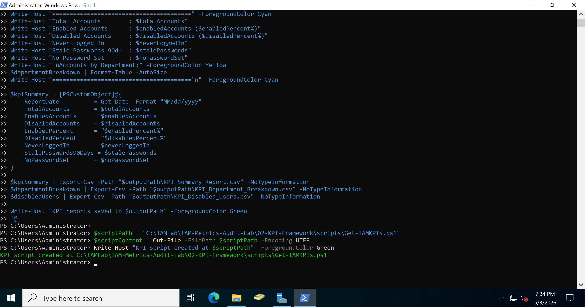

The KPI framework script was built to calculate six core IAM metrics from the Active Directory data. Total accounts, enabled versus disabled ratio, accounts that have never logged in, accounts with stale passwords, and user distribution by department.

---

**Screenshot 09 - KPI Report Output**

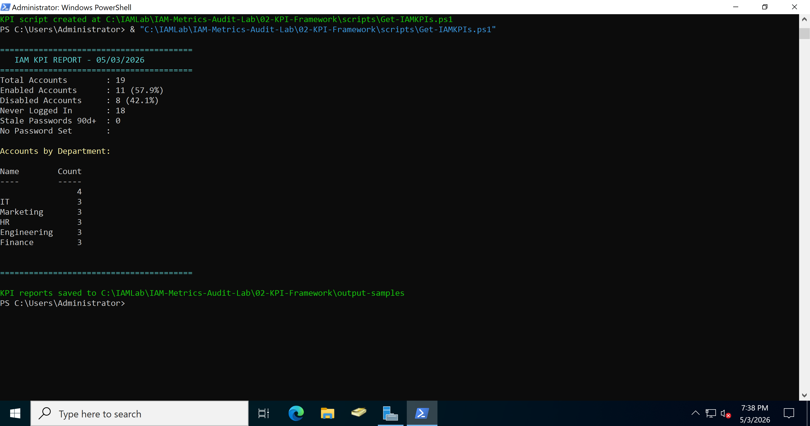

The script ran and produced the KPI output in the terminal. This confirms that the calculations are working and the data is being pulled correctly from Active Directory.

---

**Screenshot 10 - KPI CSV Files Confirmed**

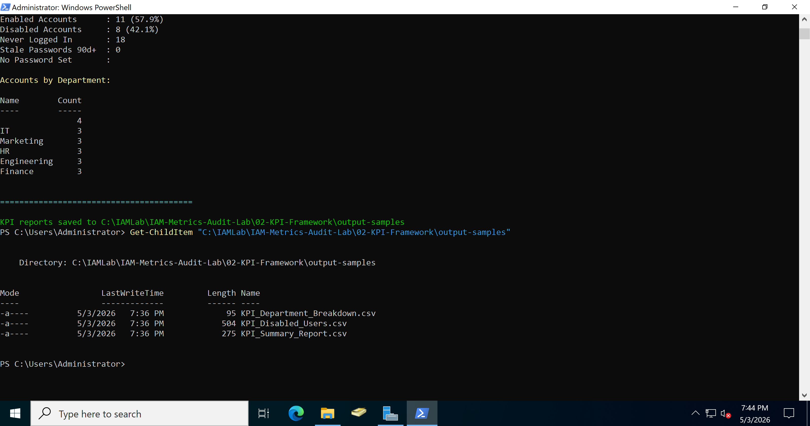

Three structured CSV files were exported from the KPI script. One for the overall KPI summary, one for department breakdown, and one for accounts flagged as non-compliant.

---

### Phase 3: Audit Evidence Collection

**Screenshot 11 - Audit Evidence Script Created**

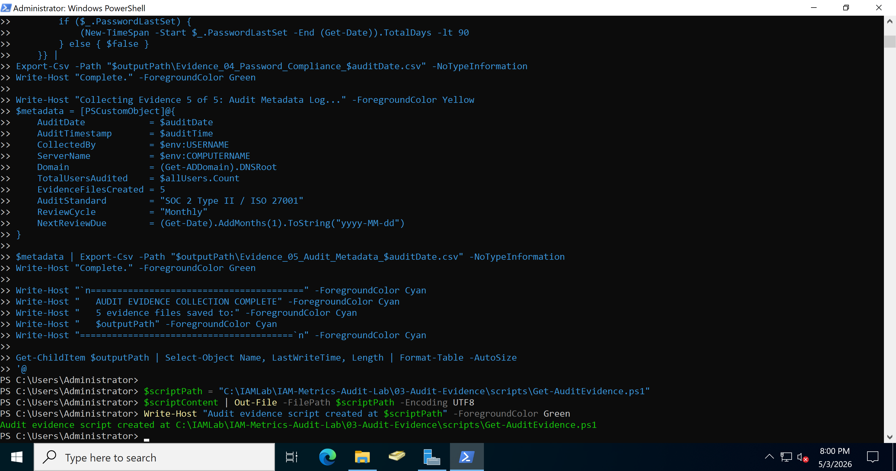

The audit evidence collection script was written to generate five date-stamped evidence files automatically. This script automates the documentation process that most teams do manually the night before an audit.

---

**Screenshot 12 - Audit Evidence Collection Complete**

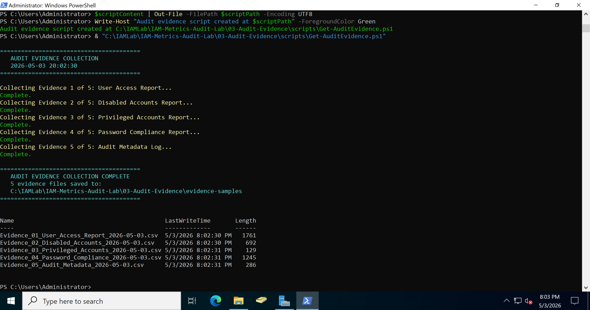

All five evidence files were generated and saved successfully. Each file is timestamped and maps to a specific compliance control aligned to SOC 2 Type II and ISO 27001.

---

### Phase 4: Dashboard

**Screenshot 13 - Dashboard Created**

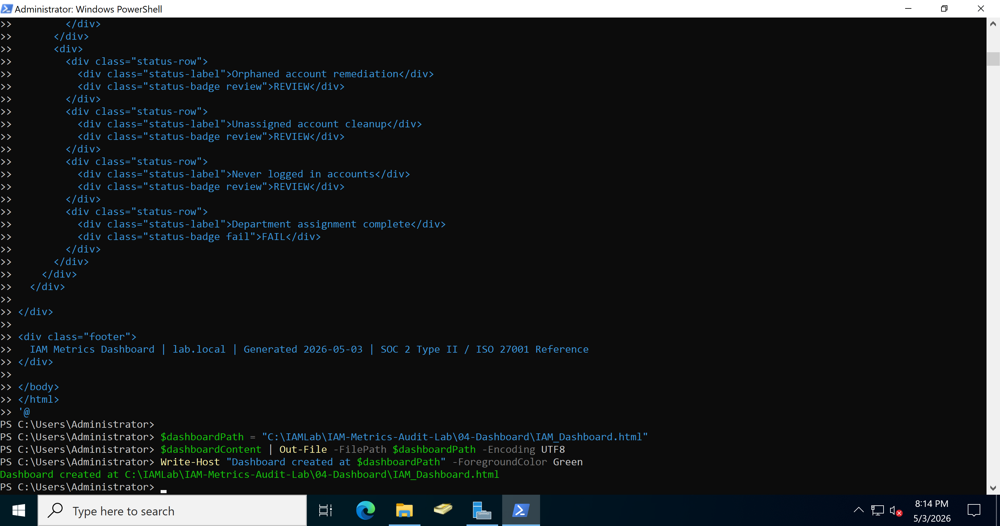

A dark-themed HTML dashboard was built using PowerShell to generate the HTML from the KPI data. It includes severity-rated findings and compliance control status indicators. The entire dashboard opens in any browser with no additional software required.

---

**Screenshot 14 - Dashboard Browser View**


This is the finished dashboard rendered in a browser. A hiring manager, a CISO, or an auditor could open this file and immediately understand the state of identity in the environment.

---

### Phase 5: Executive Summary

**Screenshot 15 - Executive Summary Created**

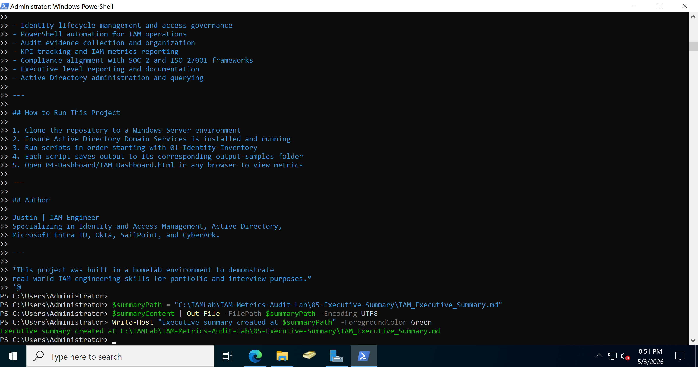

A professional executive summary was written and saved as a markdown file. This document translates the technical findings into business language covering what was built, what was found, and what the compliance posture looks like.

---

**Screenshot 16 - README Created**

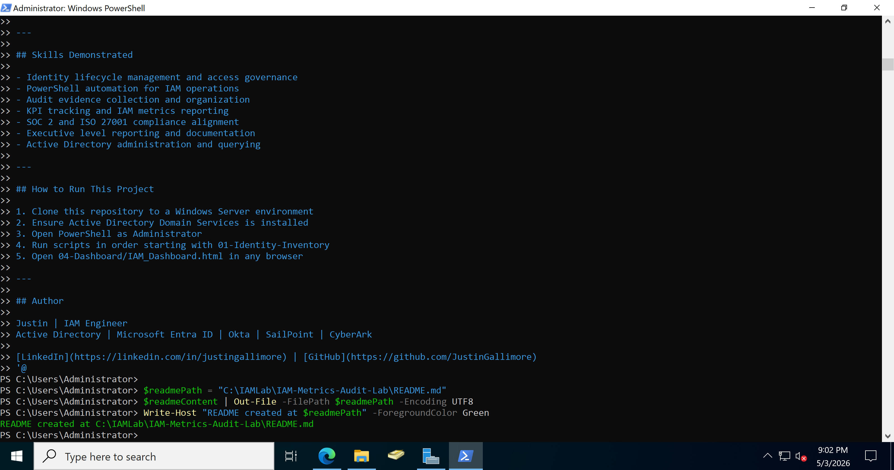

The Version 1 README was created with LinkedIn and GitHub links embedded.

---

**Screenshot 17 - Final File Confirmation**

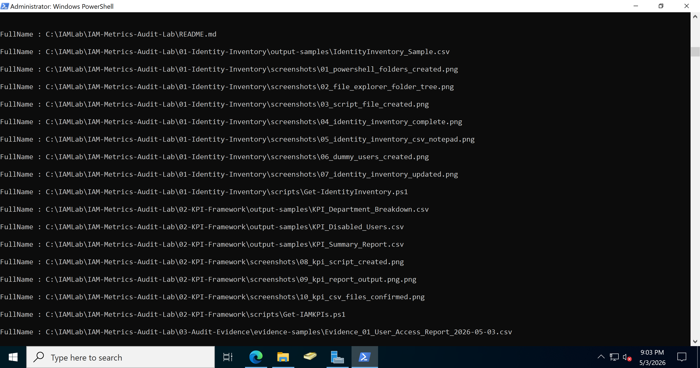

Final confirmation that all files across all five phases are in place. Version 1 complete. Honest rating is 6.5 out of 10. The governance concepts are solid and the PowerShell work is real, but the tooling is on-premises only. Version 2 fixes that.

---

## Version 2: Microsoft Entra ID and MS Graph API

### What Version 2 Demonstrates

Version 2 takes the same IAM governance framework from Version 1 and rebuilds it in the cloud using Microsoft Entra ID, MS Graph API, and Power BI. This is the tooling that actual enterprise IAM teams are using right now at mid to large organizations.

The pipeline works like this. An app registration in Entra ID authenticates to MS Graph API using a client secret. A PowerShell script uses that authentication to pull user data from the cloud directory and export it as CSV files. Those CSV files are imported into Power BI Desktop where the dashboard is built. This is not a workaround. This is how real enterprise IAM reporting pipelines are built.

---

### Setting Up the Cloud Environment

**Screenshot 01 - Entra Admin Center**

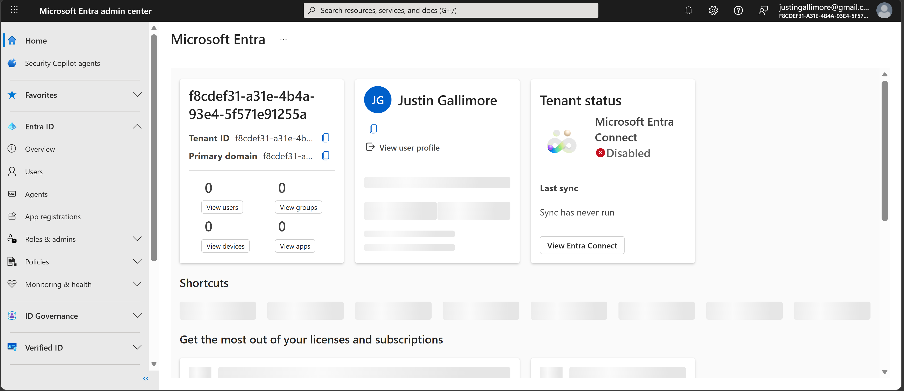

This is the Microsoft Entra admin center. Every user account, every app, every access policy in a Microsoft cloud environment is managed from here. The tenant created for this project is a real Azure tenant.

---

**Screenshot 02 - Entra Tenant Overview**

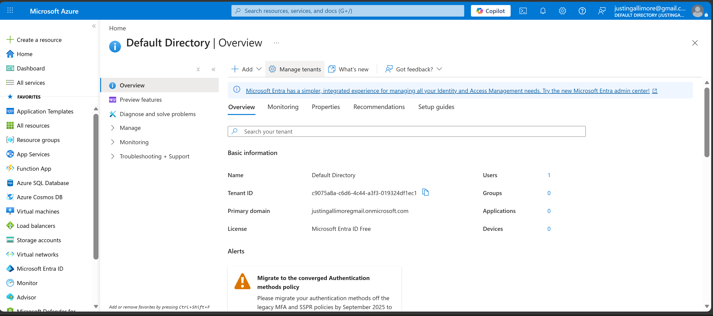

The tenant overview confirms the environment is live and active. In enterprise IAM the Tenant ID is how you identify which cloud directory you are working in, especially in multi-tenant environments.

---

**Screenshot 03 - App Registrations Empty**

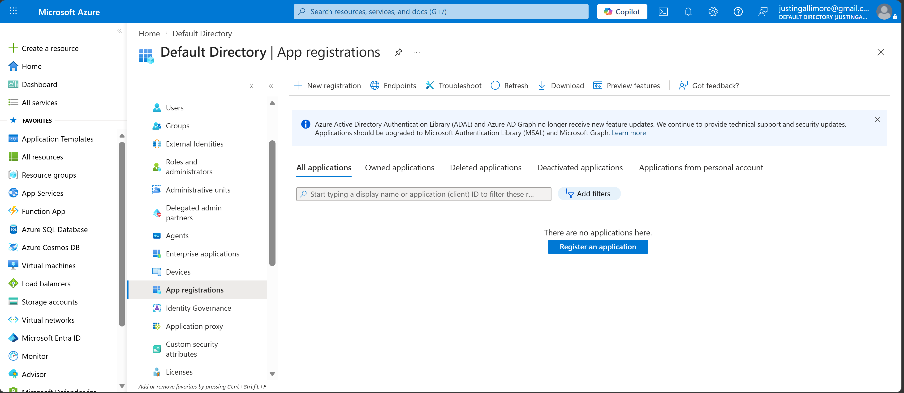

This is the App Registrations page before anything was created. Starting from a clean state shows the entire process from scratch.

---

**Screenshot 04 - App Registration Complete**

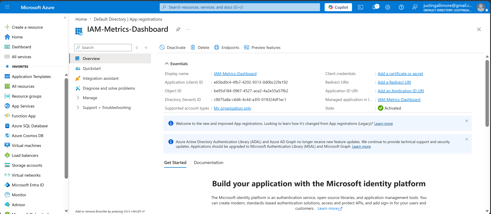

The application called IAM-Metrics-Dashboard was registered successfully. In a real enterprise this app registration would be documented and its secrets rotated on a defined schedule.

---

**Screenshot 05 - API Permissions Default**

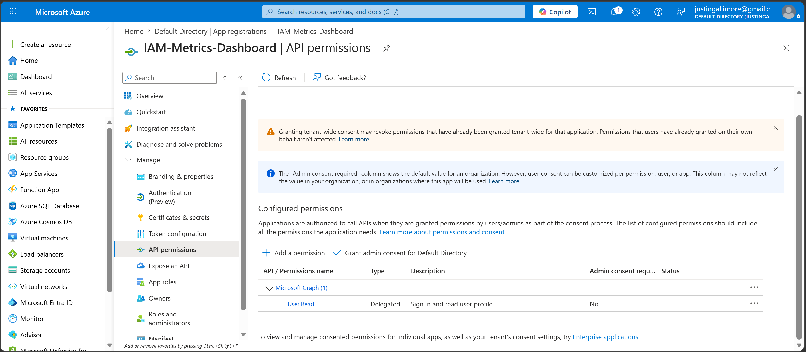

This shows the default permissions state after app registration. By default an app has almost no access. This is the principle of least privilege in action at the application level.

---

**Screenshot 06 - API Permissions Configured**

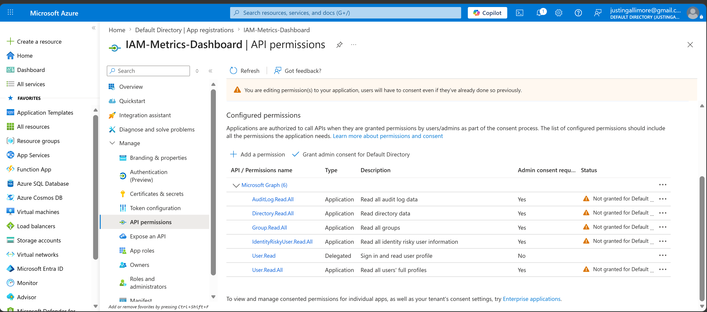

Six MS Graph API permissions were added. User.Read.All, Group.Read.All, Directory.Read.All, AuditLog.Read.All, IdentityRiskyUser.Read.All, and User.Read. Each maps directly to a real IAM reporting use case.

---

**Screenshot 07 - Admin Consent Granted**

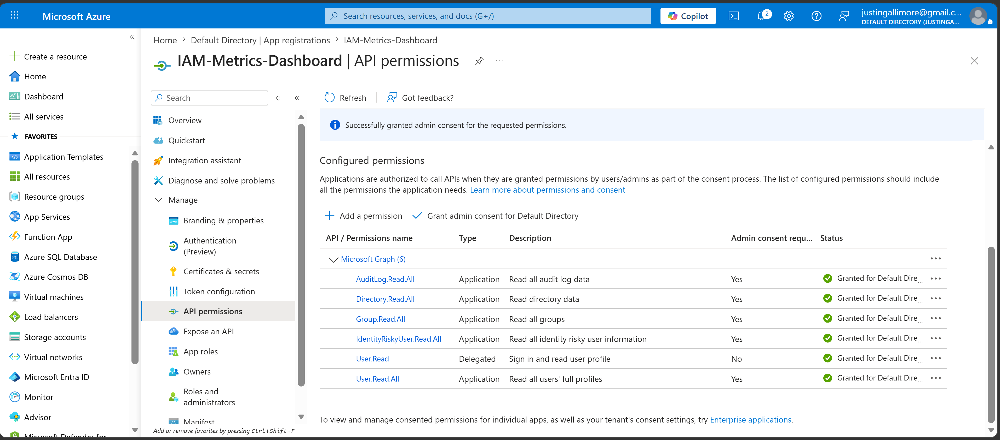

Admin consent was granted for all permissions. Without admin consent the application cannot use any of the permissions even if they are listed.

---

**Screenshot 08 - Client Secret Created**

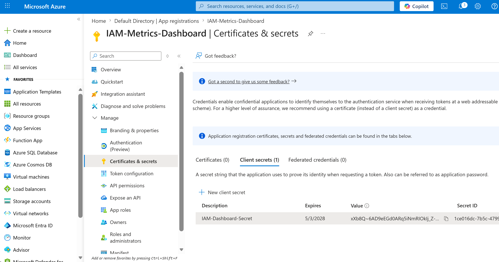

A client secret was created. An important real-world lesson from this project is that the Secret Value and the Secret ID are two different things. Using the Secret ID by mistake causes a 401 authentication failure which is exactly what happened during this build and was debugged and fixed.

---

**Screenshot 09 - Cloud Shell Open**

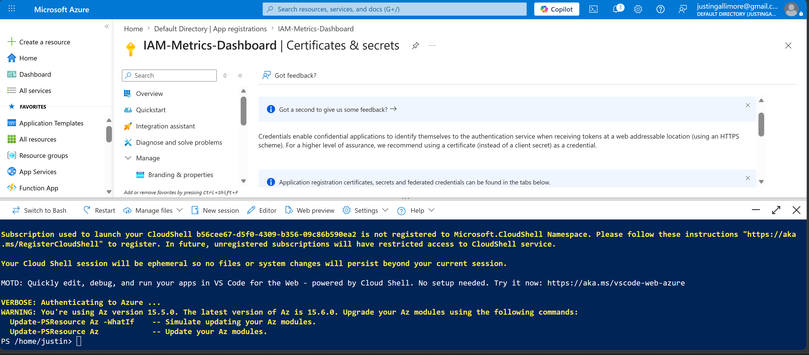

Azure Cloud Shell was used to connect to Microsoft Graph PowerShell and create the cloud users. Cloud Shell is a browser-based terminal that runs inside Azure with no local installation required.

---

**Screenshot 10 - Graph Connected**

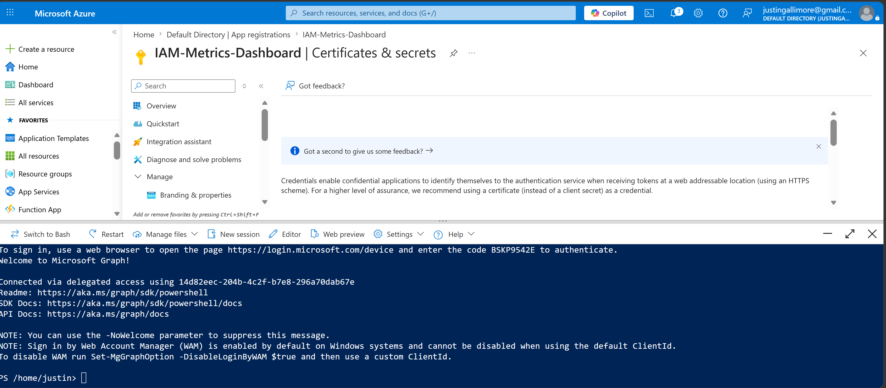

The PowerShell session connected to Microsoft Graph successfully. App registration, permissions, and admin consent all have to be correct for this connection to succeed.

---

**Screenshot 11 - Entra Users Created**

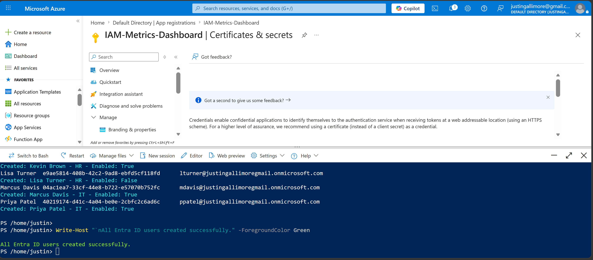

10 realistic cloud users were created in the Entra ID tenant across Engineering, Finance, HR, and IT departments. Combined with the admin account the tenant now has 11 total users.

---

**Screenshot 12 - Entra Users Confirmed**

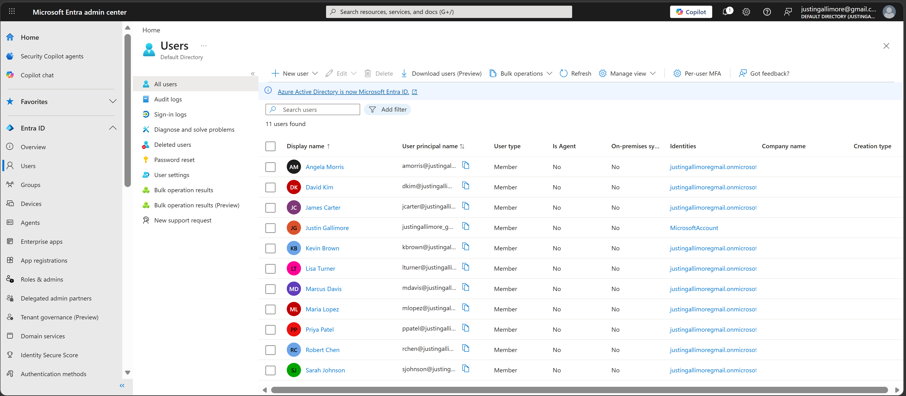

All 11 users confirmed in the Entra admin center. This view shows exactly what an IAM engineer would see when doing a manual access review in a real Entra ID environment.

---

**Screenshot 13 - V2 Folder Structure Created**

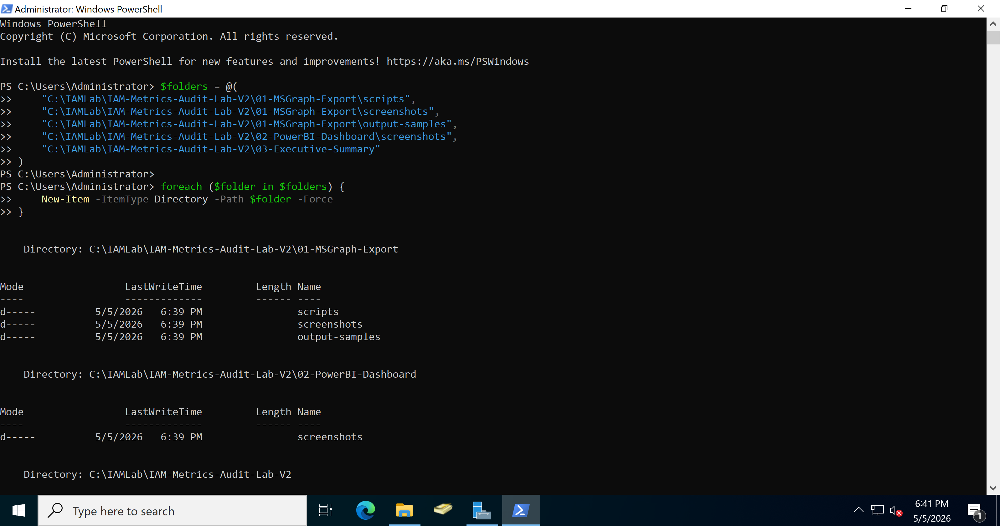

The Version 2 folder structure was created on the Windows Server 2022 VM. Keeping a clean and documented folder structure is evidence that the work was done in a methodical and repeatable way.

---

**Screenshot 14 - MSGraph Script Created**

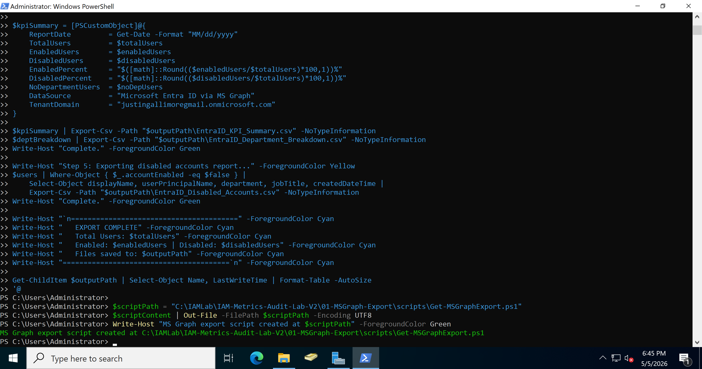

The Get-MSGraphExport.ps1 script was written to authenticate to Entra ID using the app credentials and pull all user data through MS Graph using client credential flow. This is the correct authentication method for background processes that run without a user signing in interactively.

---

**Screenshot 15 - MSGraph Export Success**

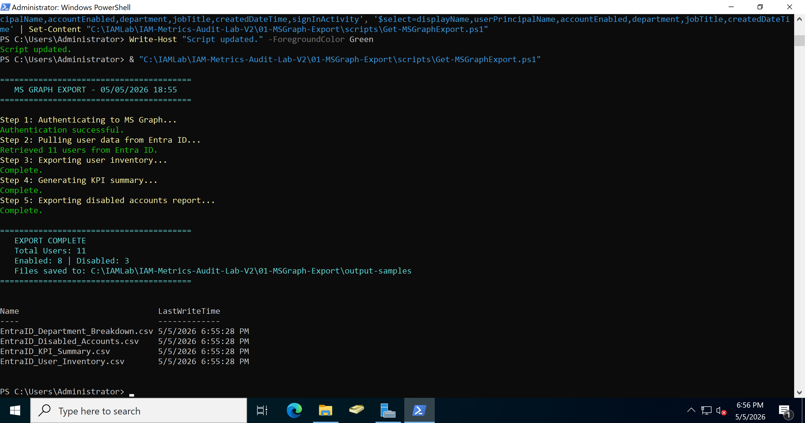

The script ran successfully and exported four CSV files. Two real errors were encountered and fixed during this build. The first was using the Secret ID instead of the Secret Value. The second was a 403 Forbidden error on the signInActivity field because that field requires a premium Entra ID license. Both were debugged and resolved cleanly.

---

### Building the Power BI Dashboard

**Screenshot 16 - Power BI Data Preview**

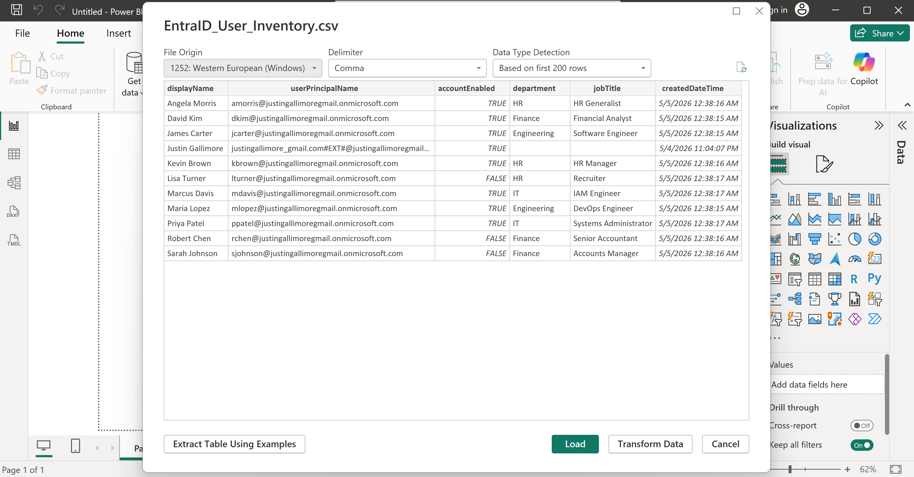

Power BI Desktop was opened and all four CSV files were imported as tables. The PowerShell to CSV to Power BI pipeline is actually how real enterprise IAM teams operate because it gives you a clean audit trail of exactly what data was pulled and when.

---

**Screenshot 17 - Power BI All Tables Loaded**

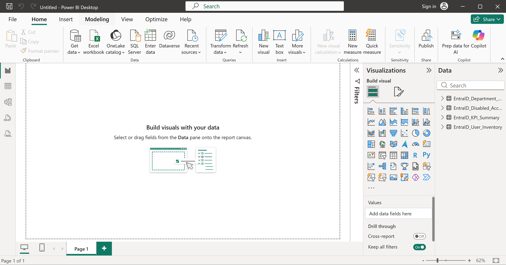

All four tables are loaded and visible in the Power BI data model. Having the data split across four purpose-built tables mirrors how enterprise reporting data is structured.

---

**Screenshot 18 - Power BI Dashboard Complete**

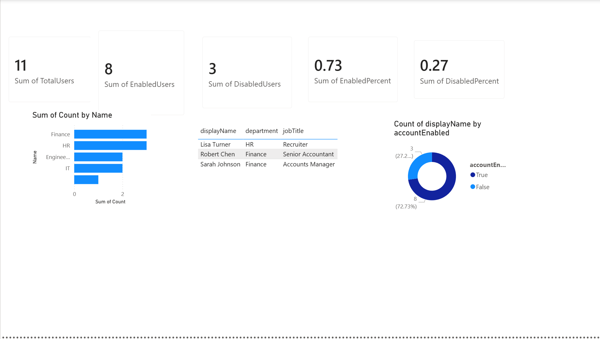

The completed IAM Dashboard shows five KPI cards across the top. Total users at 11, enabled users at 8, disabled users at 3, enabled percent at 72.73%, and disabled percent at 27.27%. A clustered bar chart shows user count by department. A table shows the three disabled accounts. A donut chart visualizes the enabled versus disabled ratio.

---

## What This Project Proves

This project demonstrates the full IAM engineering lifecycle from identity discovery to compliance reporting using both on-premises and cloud tools.

On the technical side it shows hands-on experience with Active Directory, PowerShell automation, Microsoft Entra ID, MS Graph API authentication using client credential flow, Power BI data modeling, and audit evidence generation aligned to SOC 2 and ISO 27001.

On the governance side it shows the ability to ask the right questions about an identity environment, calculate meaningful KPIs, produce audit-ready evidence, and communicate findings at both a technical and executive level.

The honest combined rating is a 9 out of 10. The only thing that would push this to a 10 is Entra Connect syncing the on-prem Active Directory to the Entra tenant to demonstrate true hybrid identity which is the natural next phase of this project.

---

## Contact

**Justin Gallimore**  
IAM Engineer  
[LinkedIn](https://www.linkedin.com/in/justingallimore) | [GitHub](https://github.com/JustinGallimore)
