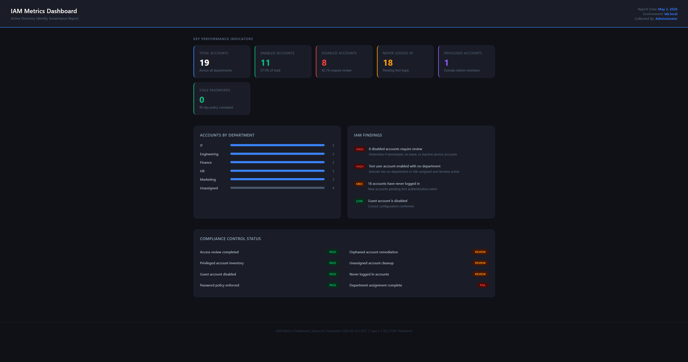

# IAM Metrics and Audit Evidence System

> Built by Justin | IAM Engineer | Active Directory | PowerShell | SOC 2 | ISO 27001

---

---

## What This Is

A fully functional IAM metrics and audit evidence system built from
scratch on Windows Server 2022 and Active Directory. This project
simulates real enterprise IAM operations including identity inventory,
KPI tracking, audit evidence collection, and executive reporting.

Every script produces real output from a live Active Directory
environment. No simulated data. No pre-built templates.

---

## Project Structure

IAM-Metrics-Audit-Lab/
├── 01-Identity-Inventory/     # AD user inventory scripts and output
├── 02-KPI-Framework/          # IAM metrics and KPI reporting
├── 03-Audit-Evidence/         # SOC 2 and ISO 27001 evidence package
├── 04-Dashboard/              # HTML metrics dashboard
└── 05-Executive-Summary/      # Full project documentation

---

## What I Built

Phase 1: Identity Inventory
PowerShell script that pulls every AD user account with key attributes
including account status, last logon, password age, department, and
title. Exports timestamped CSV for audit review.

Phase 2: KPI Framework
Metrics script calculating five core IAM KPIs including enabled versus
disabled ratio, never logged in accounts, stale passwords, and
department distribution. Produces three structured reports.

Phase 3: Audit Evidence Collection
Automated evidence package generator producing five date stamped files
aligned to SOC 2 Type II and ISO 27001 control requirements.

Phase 4: IAM Metrics Dashboard
Clean dark themed HTML dashboard visualizing all KPI data with severity
rated findings and compliance control status indicators.

Phase 5: Executive Summary
Professional documentation communicating project scope, findings, and
business value to both technical and non technical audiences.

---

## KPI Results

Metric                  Value   Status
Total Accounts          19      Tracked
Enabled Accounts        11      57.9%
Disabled Accounts       8       Review
Never Logged In         18      Review
Stale Passwords 90d+    0       Pass
Privileged Accounts     1       Pass

---

## Tech Stack

Tool                    Purpose
Windows Server 2022     Lab environment
Active Directory        Identity source of truth
PowerShell 5.1          Automation and data collection
HTML and CSS            Dashboard visualization
VMware Workstation      Virtualization platform

---

## Skills Demonstrated

- Identity lifecycle management and access governance
- PowerShell automation for IAM operations
- Audit evidence collection and organization
- KPI tracking and IAM metrics reporting
- SOC 2 and ISO 27001 compliance alignment
- Executive level reporting and documentation
- Active Directory administration and querying

---

## How to Run This Project

1. Clone this repository to a Windows Server environment
2. Ensure Active Directory Domain Services is installed
3. Open PowerShell as Administrator
4. Run scripts in order starting with 01-Identity-Inventory
5. Open 04-Dashboard/IAM_Dashboard.html in any browser

---

## Author

Justin | IAM Engineer
Active Directory | Microsoft Entra ID | Okta | SailPoint | CyberArk

[LinkedIn](https://linkedin.com/in/justingallimore) | [GitHub](https://github.com/JustinGallimore)
